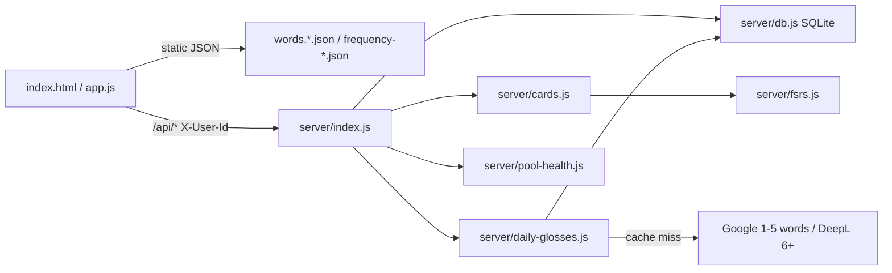

# Code map

Which files do what, how data moves, where state lives. First person. Product rules live in `scaffold/CODEMAP-LLM.md`. Run commands live in root `README.md`.

## Layout

```
src/client/                 # the PWA I serve as static files (no bundler)
  index.html                # shell, four tabs, settings overlay; English text is first-paint only
  styles.css
  app.js                    # all UI; MODE_CONFIGS; talks to /api/* with X-User-Id
  i18n.js                   # en + pt-BR catalogs; t(); applyAppLanguage overwrites [data-i18n]
  ten-logic.js              # pure helpers (startup tab, review goal, frequency filters, TTS voice pick)
  daily-pool.js             # pick/reconcile today's 5/new list; WORDS_PER_DAY; pool-days math
  client-load.js            # planBootDataLoads — priority vs background tab data
  ops.html / ops.js         # /ops.html dashboard (dev users)
  words.{pt-br,fr-ca,fr-fr,es-ar}.json
  frequency-{pt-br,fr,es-ar}.json
  confetti.browser.js       # vendored canvas-confetti
  manifest.json, icon-192.png, icon-512.png

server/
  index.js                  # Node HTTP: static + /api/*
  db.js                     # SQLite schema, users, unlocks, daily assignment/index/glosses, translation_cache
  cards.js                  # flashcard CRUD + review queue + grade
  fsrs.js                   # ts-fsrs wrapper
  daily-glosses.js          # resolve today's 5/new glosses (cache, then Google/DeepL)
  pool-health.js            # ops runway report
  *.test.js                 # server unit tests next to the module

tests/                      # client-side and db helper tests
scripts/
  check-words.js            # npm run words:check
  download-frequency-dictionaries.js
  check-deepl.js / check-google.js
  import-anki-cards.js
data/ten.db                 # runtime SQLite (gitignored); TEN_DB_PATH override
```

`app.js` is the only UI controller. Pure logic I can unit-test without the DOM lives in `ten-logic.js`, `daily-pool.js`, `client-load.js`, `i18n.js`.

## Flow



Boot (in `app.js`): remembered user → `/api/me` or login → `resolveStartupTab` from localStorage confetti/review gates → `planBootDataLoads` → priority tab data, 5/new glosses via `/api/daily-glosses/ensure` on any tab, the rest in background.

5/new: pool JSON + unlocked set + saved assignment → `reconcileDailyWords` → `/api/daily-words` + `/api/daily-progress`. Viewing a card unlocks it (`/api/unlocked-words`).

5/review: `/api/cards/queue` → grade `/api/cards/:id/answer`. Daily dots count is localStorage only; FSRS state is SQLite.

Progress: bundled frequency JSON; green = unlocked set. Translate: `/api/translate` (no user header); single learning-language word also POSTs unlock.

## State

```
browser localStorage
  ten-user-v1                         # {id, username} so I stay signed in
  ten-active-mode                     # last learning track (legacy sessionStorage migrated once)
  ten-daily-confetti-v1:LANG:date     # 5/new celebration already fired
  ten-review-confetti-v1:LANG:date
  ten-review-daily-progress-v1:LANG:date   # integer graded toward 5
  ten-seen-daily-words-v1             # leftover; imported to SQLite then removed

SQLite  TEN_DB_PATH || data/ten.db
  users, user_languages, feedback
  unlocked_words                      # Progress green + 5/new exclusion
  daily_word_assignment               # today's 5 headwords
  daily_card_index                    # which 5/new card is open
  daily_word_glosses                  # translated 5/new fields per app-lang pole
  translation_cache                   # Google/DeepL results
  cards                               # flashcard text + FSRS columns

bundled JSON under src/client/        # pools + frequency lists; not per-user
env                                   # GOOGLE_TRANSLATE_API_KEY, DEEPL_AUTH_KEY, PORT, TEN_DB_PATH
Web Speech API                        # TTS in the phone browser
```

In-memory UI state is the `state` object in `app.js` (active tab/mode, today's words, review queue, gloss cache). It is rebuilt from the stores above on load.
